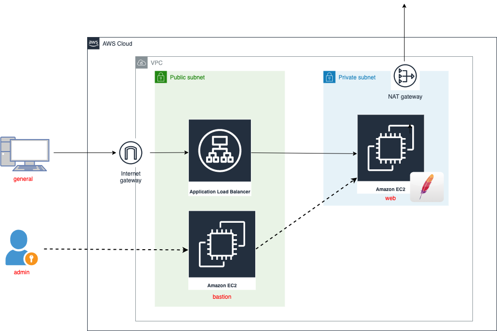

# alb_maintenance_infra

https://zenn.dev/lightkun/articles/f1f8a8269da4a9
の検証リポジトリ

### terraform起動

tfstate用のs3バケットを作成しておく
EC2にアクセスできるようにキーペアを作成しておく

```bash
$ cd app/
$ touch backend.conf
$ touch terraform.tfvars
```

以下をbackend.confに記載

```
bucket = "[バケット名]"
key = "[キー名]"
region = "[リージョン名]"
```

以下をterraform.tfvarsに記載

```
allow_cidr_block="[EC2とALBにアクセスしたいIPアドレス]"
key_name="[作成したキーペアのID]"
```

```bash
$ terraform init -backend-config=backend.conf
$ terraform plan
$ terraform apply
```

### EC2作業

踏み台EC2サーバー(bastion)にキーペアでアクセス。
scpで踏み台EC2サーバーにキーペアを送信。
sshで踏み台EC2サーバーに入り、そこからprivate subnetにあるEC2にsshでアクセス。

apacheを起動する

```
$ sudo yum update
$ sudo yum install httpd
$ sudo systemctl start httpd.service
```

### 構成図


